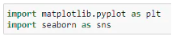
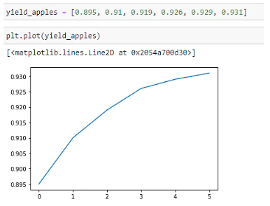
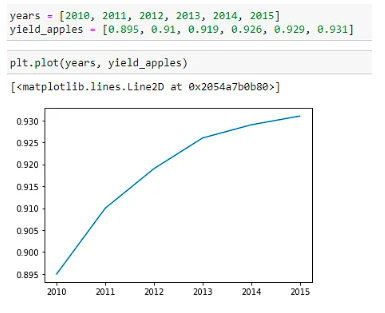
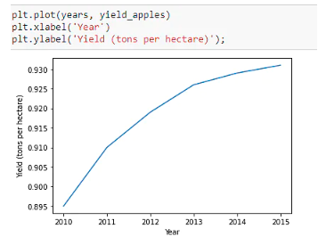

## Data Visualization 


## What is Data Visualization?
Data visualization is a field in data analysis that deals with visual representation of data. It graphically plots data and is an effective way to communicate inferences from data.

Using data visualization, we can get a visual summary of our data. With pictures, maps and graphs, the human mind has an easier time processing and understanding any given data. Data visualization plays a significant role in the representation of both small and large data sets, but it is especially useful when we have large data sets, in which it is impossible to see all of our data, let alone process and understand it manually.

## Data Visualization in Python
Python offers several plotting libraries, namely Matplotlib, Seaborn and many other such data visualization packages with different features for creating informative, customized, and appealing plots to present data in the most simple and effective way.

## Matplotlib and Seaborn
Matplotlib and Seaborn are python libraries that are used for data visualization. They have inbuilt modules for plotting different graphs. While Matplotlib is used to embed graphs into applications, Seaborn is primarily used for statistical graphs.

But when should we use either of the two? Let’s understand this with the help of a comparative analysis. The table below provides comparison between Python’s two well-known visualization packages Matplotlib and Seaborn.

| Matplotlib      | Seaborn |
| ----------- | ----------- |
| It is used for basic graph plotting like line charts,  bar graphs, etc. | It is mainly used for statistics visualization and can perform complex visualizations with fewer commands. |
| It mainly works with datasets and arrays. | It works with entire datasets. |
| Seaborn is considerably more organized and functional than Matplotlib and treats the entire dataset as a solitary unit. | Matplotlib acts productively with data arrays and frames. It regards the aces and figures as objects. |
| Seaborn has more inbuilt themes and is mainly used for statistical analysis. | Matplotlib is more customizable and pairs well with Pandas and Numpy for Exploratory Data Analysis. |

## Line Charts
A Line chart is a graph that represents information as a series of data points connected by a straight line. In line charts, each data point or marker is plotted and connected with a line or curve. 

Let's consider the apple yield (tons per hectare) in Kanto. Let's plot a line graph using this data and see how the yield of apples changes over time. We start by importing Matplotlib and Seaborn.
<br>


## Using Matplotlib
We are using random data points to represent the yield of apples. 
<br>
<br>
To better understand the graph and its purpose, we can add the x-axis values too<br>
<br>
Let's add labels to the axes so that we can show what each axis represents.<br>
<br>

To plot multiple datasets on the same graph, just use the plt.plot function once for each dataset. Let's use this to compare the yields of apples vs. oranges on the same graph.


Data visualization is the discipline of trying to understand data by placing it in a visual context so that patterns, trends, and correlations that might not otherwise be detected can be exposed.

Python offers multiple great graphing libraries packed with lots of different features. Whether you want to create interactive or highly customized plots, Python has an excellent library for you.

To get a little overview, here are a few popular plotting libraries:

- Matplotlib: low level, provides lots of freedom
- Pandas Visualization: easy to use interface, built on Matplotlib
- Seaborn: high-level interface, great default styles
- plotnine: based on R’s ggplot2, uses Grammar of Graphics
- Plotly: can create interactive plots
In this article, we will learn how to create basic plots using Matplotlib, Pandas visualization, and Seaborn as well as how to use some specific features of each library. This article will focus on the syntax and not on interpreting the graphs, which I will cover in another blog post.

## Importing Datasets
In this article, we will use two freely available datasets. The Iris and Wine Reviews dataset, which we can both load into memory using pandas read_csv method.

Matplotlib
Matplotlib is the most popular Python plotting library. It is a low-level library with a Matlab-like interface that offers lots of freedom at the cost of having to write more code.

To install Matplotlib, pip, and conda can be used.
```
pip install matplotlib
or
conda install matplotlib
```

Matplotlib is specifically suitable for creating basic graphs like line charts, bar charts, histograms, etc. It can be imported by typing:
```
import matplotlib.pyplot as plt
```

## Scatter Plot
To create a scatter plot in Matplotlib, we can use the scatter method. We will also create a figure and an axis using plt.subplots to give our plot a title and labels.
```
create a figure and axis
fig, ax = plt.subplots()

# scatter the sepal_length against the sepal_width
ax.scatter(iris['sepal_length'], iris['sepal_width'])
# set a title and labels
ax.set_title('Iris Dataset')
ax.set_xlabel('sepal_length')
ax.set_ylabel('sepal_width')
```

## Line Chart
In Matplotlib, we can create a line chart by calling the plot method. We can also plot multiple columns in one graph by looping through the columns we want and plotting each column on the same axis.
```
 get columns to plot
columns = iris.columns.drop(['class'])
 create x data
x_data = range(0, iris.shape[0])
create figure and axis
fig, ax = plt.subplots()
 plot each column
for column in columns:
    ax.plot(x_data, iris[column])
 set title and legend
ax.set_title('Iris Dataset')
ax.legend()
```

## Bar Chart
A bar chart can be created using the bar method. The bar chart isn’t automatically calculating the frequency of a category, so we will use pandas value_counts method to do this. The bar chart is useful for categorical data that doesn’t have a lot of different categories (less than 30) because else it can get quite messy.
```
# create a figure and axis 
fig, ax = plt.subplots() 
# count the occurrence of each class 
data = wine_reviews['points'].value_counts() 
# get x and y data 
points = data.index 
frequency = data.values 
# create bar chart 
ax.bar(points, frequency) 
# set title and labels 
ax.set_title('Wine Review Scores') 
ax.set_xlabel('Points') 
ax.set_ylabel('Frequency')
```